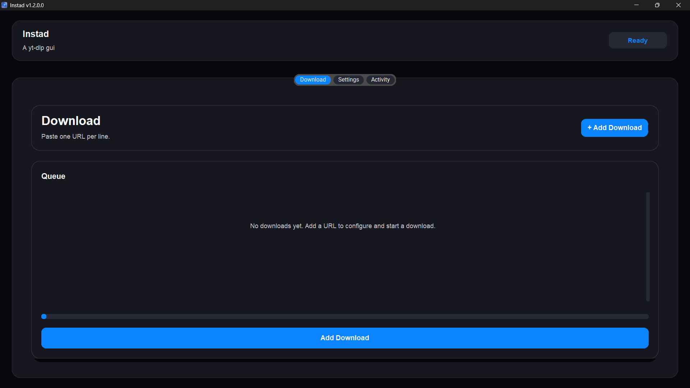
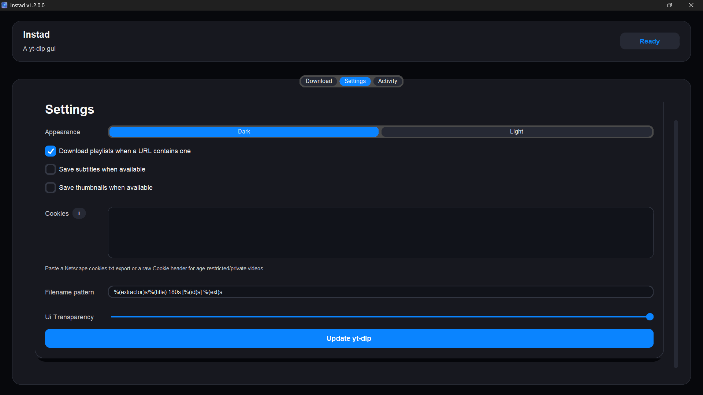
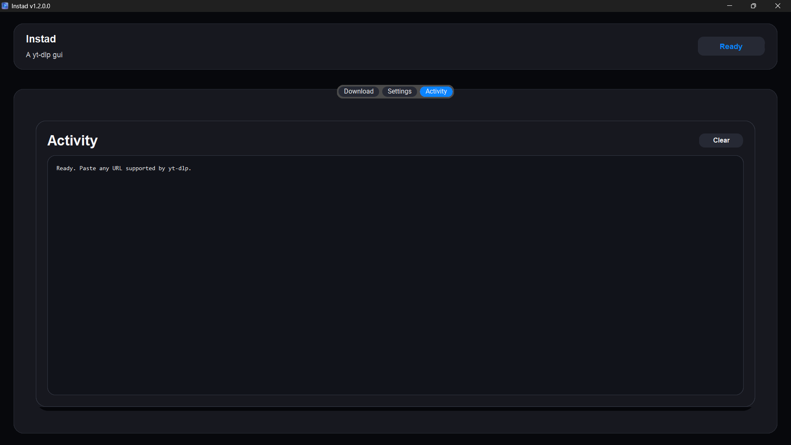
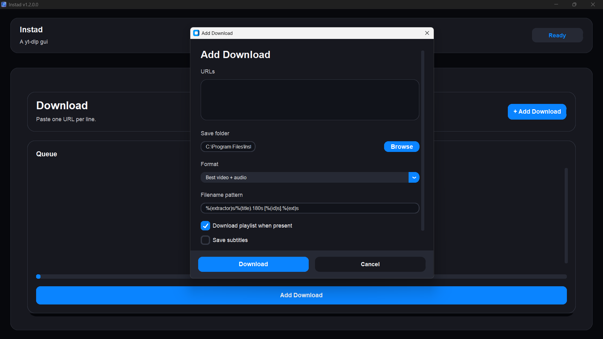
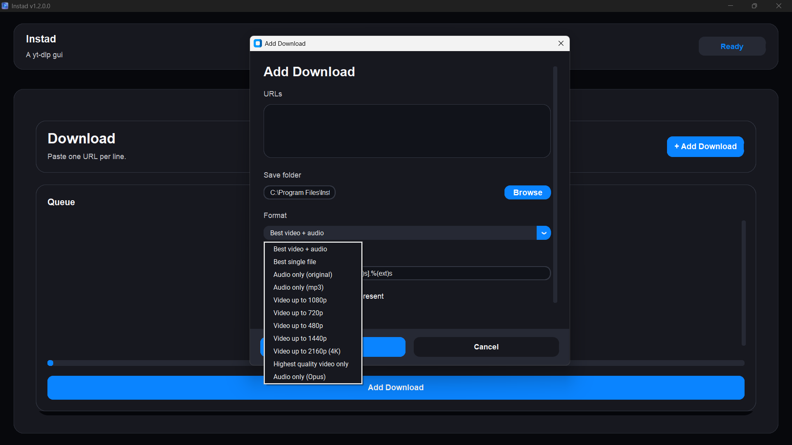

<p align="center">
  
</p>


#### **Instad** is a Python-based yt-dlp GUI for fetching videos, playlists, clips, posts, reels, and audio from platforms supported by `yt-dlp`.

## Legal Copyright Disclaimer

> [!CAUTION]
> Please be aware that videos on platforms like YouTube may be protected by copyright (DMCA). The creator of Instad does not support, and cannot be held accountable for, any use of this application that infringes upon these legal protections.

---

## Features
- Download any URL supported by yt-dlp
- add multiple urls in queue
- Download playlists when present
- Choose between quality
- Paste cookies in Settings for age-restricted, private, or signed-in downloads
- Accepts Netscape `cookies.txt` exports or a raw browser `Cookie:` header
- Modern  GUI built with `customtkinter`
- Automatic fallback to TUI mode if no graphical display is available

---

## Requirements
- Python 3.13+
- ffmpeg installed and available in PATH
- Deno installed and available in PATH (for YouTube signature solving)
- Dependencies listed in `requirements.txt`

---

## Installation

```bash
git clone https://github.com/debojitsantra/instad.git
cd instad
python -m venv venv
# Windows
venv\Scripts\activate
# Linux
source venv/bin/activate

pip install -r requirements.txt
```

### Install ffmpeg
**Windows:**
```powershell
winget install Gyan.FFmpeg
```
**Linux/WSL:**
```bash
# Debian
sudo apt install ffmpeg -y
# Arch
sudo pacman -S ffmpeg
# Fedora
sudo dnf install ffmpeg
```
### Install Deno

**Windows**
```powershell
irm https://deno.land/install.ps1 | iex
```
**Linux/WSL**
```bash
curl -fsSL https://deno.land/install.sh | sh
```
##### Linux Requirements

If the app fails to start with a Fontconfig or font-related error, install:

```bash
## Debian
sudo apt install -y fontconfig fonts-dejavu-core fonts-liberation2
## Arch
sudo pacman -S fontconfig ttf-dejavu ttf-liberation
## Fedora
sudo dnf install fontconfig dejavu-sans-fonts liberation-fonts
```

(Required for some Linux distributions and WSL setups.)

---

## Screenshots

<p align="center">
  
  
  
  
  
</p>

## Usage

```bash
python instad.py
```


---

## Cookies

### Getting a Netscape `cookies.txt` file

Use a browser extension to export cookies in Netscape format, then paste the contents into Settings -> Cookies.

**Chromium-based browsers (Chrome, Brave, Edge, etc.)**
1. Install [Get cookies.txt LOCALLY](https://chromewebstore.google.com/detail/get-cookiestxt-locally/cclelndahbckbenkjhflpdbgdldlbecc) from the Chrome Web Store.
2. Sign in to the site you want to download from (e.g. YouTube).
3. Click the extension icon, select the current site, and export/copy the `cookies.txt` content.
4. Paste it into Settings -> Cookies in Instad.

**Firefox**
1. Install [cookies.txt](https://addons.mozilla.org/en-US/firefox/addon/cookies-txt/) from Firefox Add-ons.
2. Sign in to the site you want to download from.
3. Click the extension icon to export the current tab's cookies as `cookies.txt`.
4. Open the exported file and paste its contents into Settings -> Cookies in Instad.

> [!TIP]
> Export cookies again if a download starts failing with an authentication or age-restriction error — cookies expire or get invalidated after logout.

> [!WARNING]
> Cookies grant access to your signed-in session. Don't share your `cookies.txt` or paste it into untrusted apps.

---

## Pre-built Binaries

Download the latest release for your platform from the [Releases](../../releases) page:


---

## Building from Source

```bash
pip install pyinstaller

# Windows
pyinstaller --noconfirm --onefile --noconsole --icon "assets/icon.ico" --add-data "assets;assets" --name instad instad.py

# Linux
pyinstaller --onefile --add-data "assets:assets" instad.py
```

Output binary will be in `dist/`. For a custom Windows executable icon, convert `assets/icon.svg` to `.ico` and pass it with `--icon path\to\icon.ico`.

---

## Releases (CI/CD)

Releases are built automatically via GitHub Actions on every version tag push:

```bash
git tag v1.2.0.1
git push origin v1.2.0.1
```

This triggers automated Windows (.exe) and Linux binary builds, published to GitHub Releases.

---

## Supported Platforms

| Site | Type |
|---|---|
| Any yt-dlp supported site | Video / Audio / Playlists / Metadata supported by that extractor |

---

